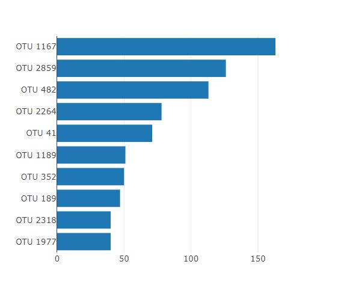
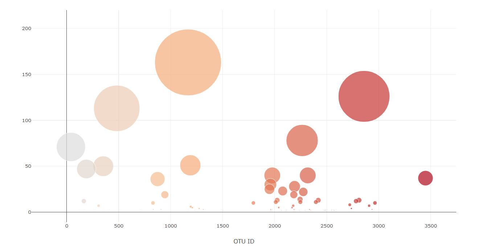
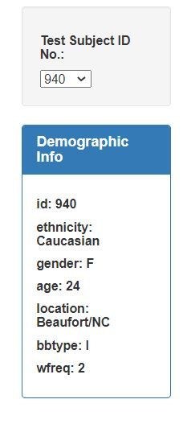
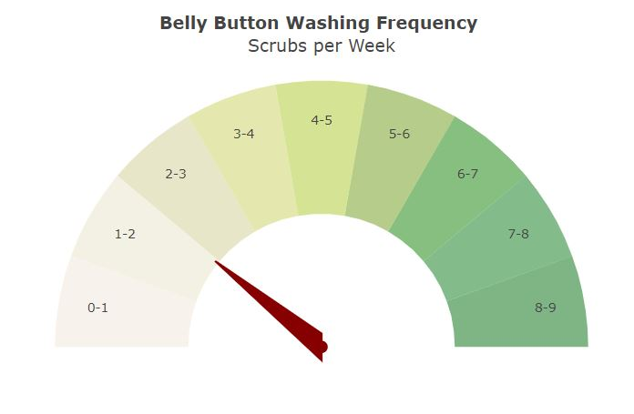

# **Plot**.**ly** - Belly Button Biodiversity
Build an interactive dashboard to explore the Belly Button Biodiversity dataset, which catalogs the microbes that colonize human navels.  
The dataset reveals that a small handful of microbial species (also called operational taxonomic units, or OTUs, in the study) were present in more than 70% of people, while the rest were relatively rare.  
Dashboard Link: https://alvin1359.github.io/belly-button-diversity-plotly/
## Project structure
```
project  
|__ images/                                 # contains images of graphs constructed
|
|__ static/                              
|         |_ css/                           # contains css styling sheets
|         |_ js/                            # contains js logic files
|
|__ README.md                               # readme file      
|
|__ index.html                              # html file to render page
|
|__ samples.json                            # JSON file containing dataset
```


### Step 1: **Plot**.**ly**
1. Use the D3 library to read in `samples.json`.

```
d3.json("samples.json").then(data => { ... }
```

2. Create a horizontal bar chart with a dropdown menu to display the top 10 OTUs found in that individual.

* Use `sample_values` as the values for the bar chart.

* Use `otu_ids` as the labels for the bar chart.

* Use `otu_labels` as the hovertext for the chart.




3. Create a bubble chart that displays each sample.

* Use `otu_ids` for the x values.

* Use `sample_values` for the y values.

* Use `sample_values` for the marker size.

* Use `otu_ids` for the marker colors.

* Use `otu_labels` for the text values.



4. Display the sample metadata, i.e., an individual's demographic information.

5. Display each key-value pair from the metadata JSON object somewhere on the page.



6. Update all of the plots any time that a new sample is selected.
```
function optionChanged(){

    var dropdownMenu = d3.select("#selDataset");

    var subjectId = parseInt(dropdownMenu.property("value"));

    plots(subjectId);
    demographicInfo(subjectId);
}
```

### BONUS

7. Create a gauge chart to plot weekly washing frequency of the individual



### Step 2: Deployment
- Deploy app to GitHub Pages
https://alvin1359.github.io/belly-button-diversity-plotly/
